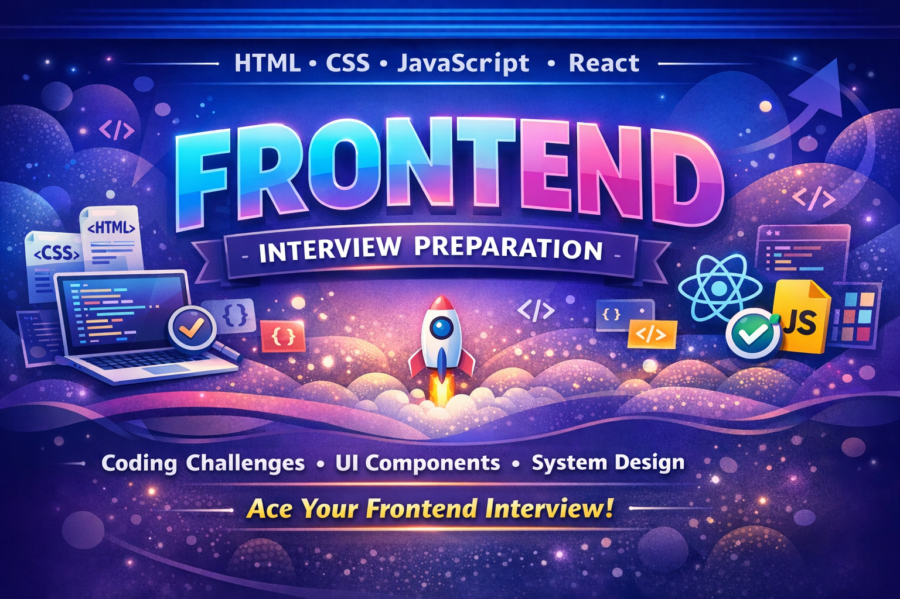

<div align="center">



<h1>⚡ Frontend Interview Preparation</h1>


<br />

<p>
  Curated resources to master <b>Frontend Developer Interviews</b> — covering
  <strong>
    HTML, CSS, JavaScript, React, Machine Coding, and Frontend System Design
  </strong>
  .
</p>

<br />


<br />
<br />


<br />
<br />

⭐ <b>If this repository helps you prepare, please give it a star!</b>

</div>

---

## 📚 About

This repository is a **structured guide for Frontend Developer interview preparation**.

It focuses on:

- Frontend fundamentals
- JavaScript deep concepts
- React architecture
- Machine coding interview questions
- Frontend system design

Ideal for developers preparing for:

- Product-based companies
- Startup engineering roles
- Frontend developer interviews

---

## 🧭 Learning Roadmap

Follow this roadmap while preparing:

```text
HTML
 ↓
CSS
 ↓
JavaScript
 ↓
React
 ↓
Machine Coding
 ↓
Frontend System Design
```

---

## 📂 Repository Structure

```text
frontend-interview-prep
│
├── html
│
├── css
│
├── javascript
│   ├── concepts
│   ├── polyfills
│   └── coding-problems
│
├── react
│   ├── concepts
│   └── interview-questions
│
├── machine-coding
│   ├── javascript
│   └── react
│
├── frontend-system-design
│
├── docs
│
└── progress
```

---

## 🌐 HTML Topics

- Semantic HTML
- Accessibility
- Forms
- SEO Basics
- HTML Interview Questions

---

## 🎨 CSS Topics

- Flexbox
- Grid
- Positioning
- Responsive Design
- CSS Animations

---

## ⚡ JavaScript Topics

Core interview concepts:

- Closures
- Hoisting
- Event Loop
- Promises & Async/Await
- Prototypes
- JavaScript Polyfills

Coding challenges include:

- Debounce
- Throttle
- Deep Clone
- LRU Cache

---

## ⚛️ React Topics

Topics included:

- React Hooks
- Component Architecture
- Context API
- Performance Optimization
- Rendering Behavior

---

## 🧠 Machine Coding Problems

### React

| Problem         | Difficulty |
| --------------- | ---------- |
| Modal Component | Easy       |
| Tabs Component  | Easy       |
| Star Rating     | Easy       |
| Accordion       | Easy       |
| Autocomplete    | Medium     |
| Infinite Scroll | Medium     |
| File Explorer   | Medium     |
| Nested Comments | Medium     |
| Kanban Board    | Hard       |

### JavaScript

| Problem              | Difficulty |
| -------------------- | ---------- |
| Debounce             | Easy       |
| Throttle             | Easy       |
| Deep Clone           | Medium     |
| Event Emitter        | Medium     |
| Promise.all Polyfill | Medium     |

---

## 🏗 Frontend System Design

Important topics for senior frontend interviews:

- Frontend architecture
- Performance optimization
- Caching strategies
- Component design patterns
- Real-world case studies

---

## 🧪 How to Use This Repository

1. Start with **HTML fundamentals**
2. Move to **CSS layouts**
3. Master **JavaScript concepts**
4. Study **React architecture**
5. Practice **machine coding problems**
6. Learn **frontend system design**

---

## 📈 Progress Tracker

Track solved problems inside:

```text
progress/learning-tracker.md
```

Example:

```text
Modal ✅
Tabs ✅
Autocomplete ⏳
Kanban Board ❌
```

---

## 🤝 Contributing

Contributions are welcome.

You can contribute by:

- Adding interview questions
- Adding machine coding problems
- Improving explanations
- Fixing documentation

Steps:

```bash
Fork the repository
Create a new branch
Commit your changes
Open a pull request
```

---

## ⭐ Support

If this repository helps you in your frontend preparation:

⭐ **Star the repository** to support the project.

---

<div align="center">

### Happy Coding 🚀

</div>
